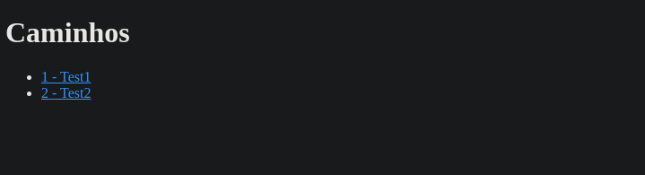
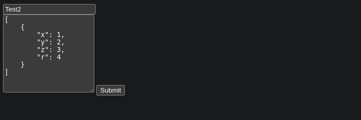
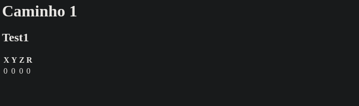
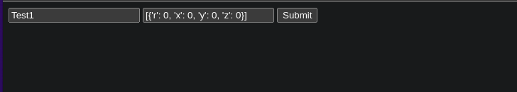
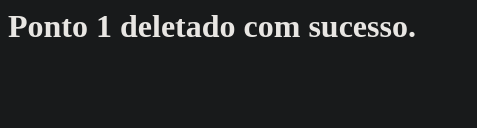

# Points-Saver

Um cadastrador de pontos para um braço robótico

Projeto desenvolvido para a P1 do módulo 5 de Engenharia da Computação do Inteli

# Rotas

## Criar path

POST `/paths`

```json
{
  "name": "Test1",
  "points": [
    {
      "x": 0,
      "y": 0,
      "z": 0,
      "r": 0
    }
  ]
}
```

retorno

```json
{
  "id": 1
}
```

## Pegar path

GET `/paths/<id>`

retorno

```json
{
  "id": 1,
  "name": "Test1",
  "points": [
    {
      "r": 0,
      "x": 0,
      "y": 0,
      "z": 0
    }
  ]
}
```

## Pegar todos os paths
GET `/paths`

retorno

```json
[
    {
        "id": 1,
        "name": "Test1",
        "points": [
            {
                "r": 0,
                "x": 0,
                "y": 0,
                "z": 0
            }
        ]
    },
    {
        "id": 2,
        "name": "Test2",
        "points": [
            {
                "r": 4,
                "x": 1,
                "y": 2,
                "z": 3
            }
        ]
    }
]
```

## Atualizar path
> Como o form não tem como action o método PUT, tive que trocar o formato dessa rota
PUT/POST `/update_path/<id>`

form

```json
{
    "name": "Test1",
    "points": [
        {
            "x": 1,
            "y": 0,
            "z": 0,
            "r": 0
        }
    ]
}
```

retorno

```json
{
    "id": "1"
}
```

## Deletar path
DELETE `/paths/<id>`

retorno

```json
{
    "id": "1"
}
```

# Páginas
## `/listas_caminhos`

retorna o id e o nome de todos os caminhos cadastrados



## `/novo`

cadastrar um novo conjunto de pontos em um caminho



## `/pegar_caminho`

recebe o id do caminho e devolve os pontos cadastrados nele



## `/atualizar`

atualiza o caminho cujo id foi fornecido



## `/deletar`

deleta o caminho com o id fornecido


